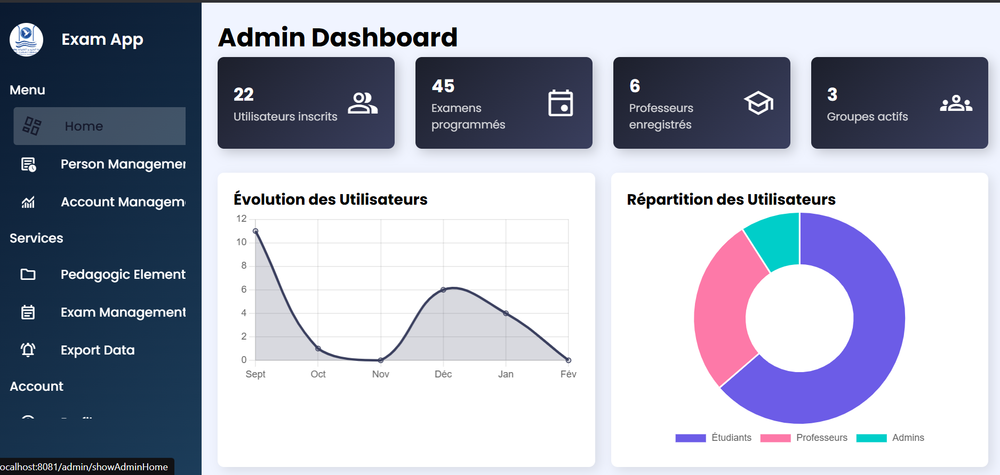
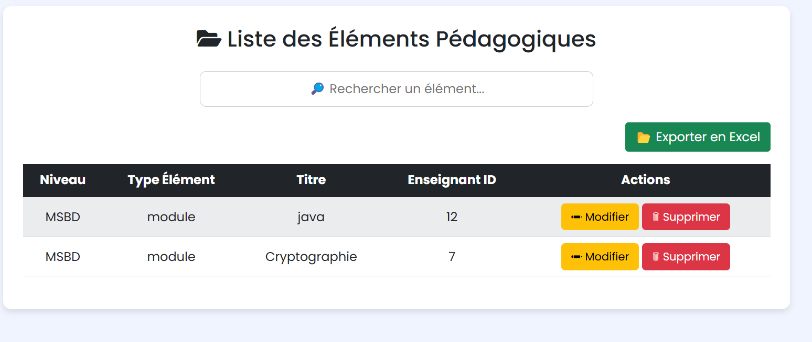
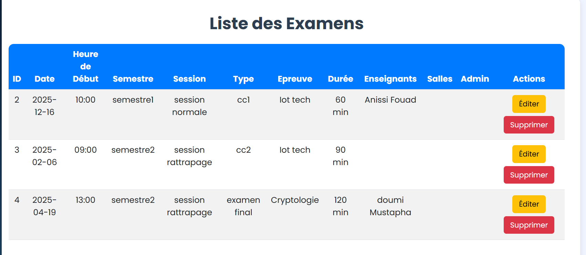
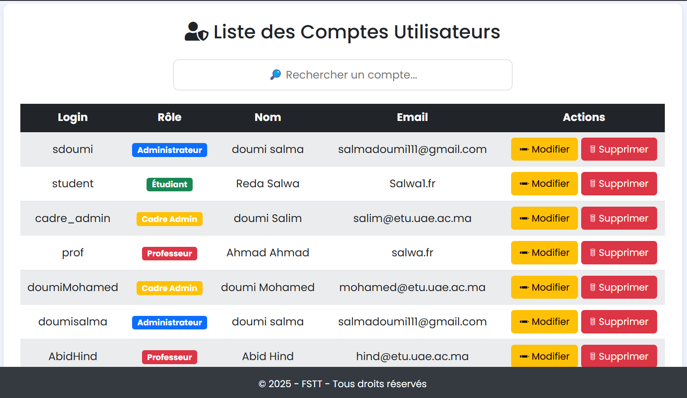

# 📚 Exam Management Application 🎓

This is a **Spring Boot MVC** application designed for managing exams in an educational institution. It allows administrators, professors, and students to manage exams, schedules, and users efficiently.

---

## 🚀 Features

✔️ **User Roles & Authentication**
   - Administrator
   - Professor
   - Student

✔️ **Exam Management**
   - Create, update, and delete exams
   - Assign professors and students to exams
   - Manage exam schedules

✔️ **Spring Security**
   - User authentication & authorization
   - Role-based access control
   - Password encryption using BCrypt

✔️ **Database (PostgreSQL)**
   - Structured schema for users, exams, schedules
   - Data integrity with Hibernate ORM

✔️ **Modern UI**
   - Built with JSP, Bootstrap, and AJAX
   - Responsive UI for different devices

---

## 🛠 Technologies Used

| Technology       | Description | Official Website |
|-----------------|-------------|------------------|
| **[Spring Boot](https://spring.io/projects/spring-boot)** | Backend framework | [spring.io](https://spring.io) |
| **[Spring Security](https://spring.io/projects/spring-security)** | Authentication & Authorization | [spring.io](https://spring.io) |
| **[Spring Data JPA](https://spring.io/projects/spring-data-jpa)** | ORM for PostgreSQL | [spring.io](https://spring.io) |
| **[PostgreSQL](https://www.postgresql.org/)** | Database management | [postgresql.org](https://www.postgresql.org/) |
| **[JSP & Bootstrap](https://getbootstrap.com/)** | Frontend UI | [getbootstrap.com](https://getbootstrap.com/) |
| **[Maven](https://maven.apache.org/)** | Dependency management | [maven.apache.org](https://maven.apache.org/) |
| **[JWT](https://jwt.io/)** | Secure authentication | [jwt.io](https://jwt.io/) |
| **[Hibernate](https://hibernate.org/)** | ORM for database handling | [hibernate.org](https://hibernate.org/) |

---

## 🏗️ System Architecture

The application follows a **3-tier architecture**:

- **Frontend**: JSP, Bootstrap, AJAX
- **Backend**: Spring Boot (MVC, Services, DAO)
- **Database**: PostgreSQL (Spring Data JPA)

📂 **Project Structure:**
```
Educational_Jee_App/ 
│── src/
│   ├── main/java/com/fstTanger/
│   │   ├── core/
│   │   │   ├── bo/           # Entities
│   │   │   ├── dao/         # Database access
│   │   │   ├── services/    # Business logic
│   │   │   ├── web/         # Controllers
│   │   │   ├── config/      # Spring Security & JWT
│   │── main/resources/
│   │   ├── application.properties
│   │── main/webapp/WEB-INF/jsp # Frontend JSP files
```

---

## 📊 Database Schema (PostgreSQL)
```
                List of relations
 Schema |        Name         | Type  |  Owner
--------+---------------------+-------+----------
 public | cadreadministrateur | table | postgres
 public | compte              | table | postgres
 public | departement         | table | postgres
 public | elementpedagogique  | table | postgres
 public | enseignant          | table | postgres
 public | etudiant            | table | postgres
 public | examen              | table | postgres
 public | filiere             | table | postgres
 public | groupe              | table | postgres
 public | niveau              | table | postgres
 public | personne            | table | postgres
 public | role                | table | postgres
 public | salle               | table | postgres
 public | surveillance        | table | postgres
 public | typeelement         | table | postgres
(15 rows)
```

---

## 🔐 Spring Security Configuration

🔸 **BCrypt Password Encoding:**
```java
@Bean
public PasswordEncoder passwordEncoder() {
    return new BCryptPasswordEncoder();
}
```

🔸 **JWT Authentication Filter:**
```java
public class JwtAuthenticationFilter extends OncePerRequestFilter {
    @Override
    protected void doFilterInternal(HttpServletRequest request, HttpServletResponse response, 
                                    FilterChain filterChain) throws ServletException, IOException {
        String token = extractToken(request);
        if (token != null && jwtUtil.validateToken(token)) {
            UserDetails userDetails = userDetailsService.loadUserByUsername(jwtUtil.getUsernameFromToken(token));
            UsernamePasswordAuthenticationToken auth = new UsernamePasswordAuthenticationToken(
                userDetails, null, userDetails.getAuthorities());
            SecurityContextHolder.getContext().setAuthentication(auth);
        }
        filterChain.doFilter(request, response);
    }
}
```

🔸 **Role-Based Access Control:**
```java
http.authorizeRequests()
    .antMatchers("/api/admin/**").hasRole("ADMIN")
    .antMatchers("/api/professor/**").hasRole("PROFESSOR")
    .antMatchers("/api/student/**").hasRole("STUDENT")
    .anyRequest().authenticated();
```

---

## ⚙️ How to Run the Project

1️⃣ **Clone the repository**
```bash
git clone https://github.com/sdoumi13/springBoot-project.git
cd springBoot-project
```

2️⃣ **Set up the Database**
Modify `application.properties` with your PostgreSQL credentials:
```properties
spring.datasource.url=jdbc:postgresql://localhost:5432/exam_db
spring.datasource.username=your_db_user
spring.datasource.password=your_db_password
spring.jpa.hibernate.ddl-auto=update
```

3️⃣ **Run the Spring Boot Application**
```bash
mvn spring-boot:run
java -jar target/Planning_exam.jar
```

4️⃣ **Open the App in the Browser**
```
http://localhost:8081
```

---

## 🖥️ Screenshots & UI Views
🔹 [Login Page](Educational_Jee_App/screenshots/login.png)

🔹 [Admin Dashboard](Educational_Jee_App/screenshots/dash_admin.png)
   - 

🔹 [Accounts-Elements-Exam Management]
   - 
   - 
   - 

---

📩 **Contact**
For any inquiries or support, feel free to contact me:
**Salma Doumi** - [salmadoumi111@gmail.com](mailto:salmadoumi111@gmail.com)

